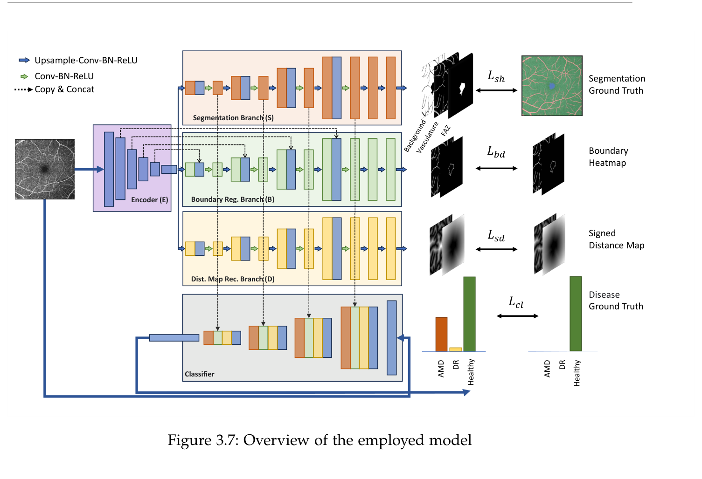
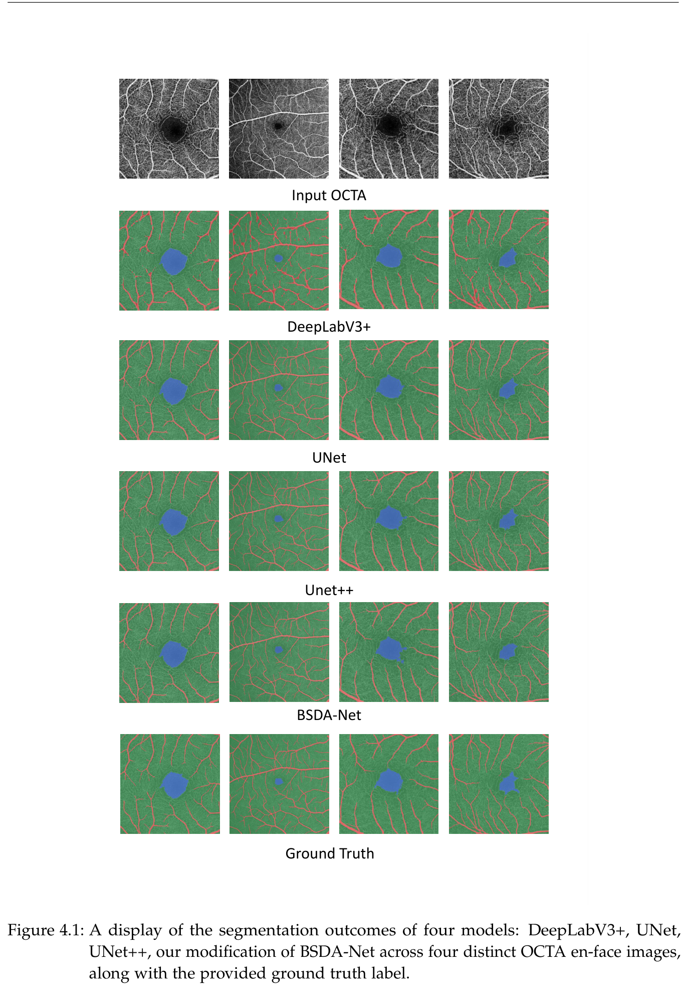

# MultitaskOCTA

**Joint retinal vessel + FAZ segmentation for OCTA-based eye disease classification.**
Master's thesis project, Technische Universität München (Department of Physics — Biomedical Physics), submitted October 2023.

This repository extends [**BSDA-Net**](https://www.researchgate.net/publication/354793161_BSDA-Net_A_Boundary_Shape_and_Distance_Aware_Joint_Learning_Framework_for_Segmenting_and_Classifying_OCTA_Images) (Lin et al., MICCAI 2021) — originally built to jointly segment the Foveal Avascular Zone (FAZ) and classify disease from OCTA (Optical Coherence Tomography Angiography) images — with **retinal vessel segmentation** as a second semantic task, and asks a focused research question: *does teaching the network to see the vasculature, not just the FAZ, actually improve disease classification?*

## Overview

Optical Coherence Tomography Angiography (OCTA) provides non-invasive, capillary-level images of the retinal vasculature. The shape of the FAZ and the morphology of the surrounding vessels are both known to shift with diabetic retinopathy (DR) and age-related macular degeneration (AMD), but most prior work segments only one of the two and rarely measures whether the added segmentation signal actually helps a downstream diagnosis.

This project:
- Integrates the **OCTA-500** dataset's vessel annotations into the BSDA-Net pipeline alongside its existing FAZ annotations, turning it into a joint RV + FAZ segmentation and 3-way (Healthy / DR / AMD) classification model.
- Adds a **clDice** loss term ([Shit et al., CVPR 2021](https://github.com/jocpae/clDice)) to the segmentation objective to preserve vessel topology/connectivity, which plain Dice loss tends to break on thin capillaries.
- Runs a controlled ablation comparing classification performance with **no segmentation** (plain ResNeSt50), **FAZ-only segmentation** (original BSDA-Net), and **joint RV+FAZ segmentation** (this work), to isolate the effect of vascular semantic information on diagnostic accuracy.

<p align="center">
  
  <br>
  <em>Shared encoder with a segmentation decoder (vessel + FAZ) and two auxiliary decoders (boundary heatmap, signed distance map) feeding a joint disease classifier.</em>
</p>

## Results

All numbers below are from 5-fold cross-validation on the OCTA-500 superficial en-face images (see thesis for full discussion).

**Segmentation** (Jaccard / Dice / clDice, %):

| Method | Jaccard | Dice | clDice |
|---|---|---|---|
| DeepLabV3+ | 88.4 ± 2.2 | 92.5 ± 1.6 | 77.6 ± 2.7 |
| UNet | 91.3 ± 1.5 | 97.1 ± 2.5 | 92.3 ± 1.9 |
| UNet++ | 92.2 ± 1.6 | 97.4 ± 2.1 | **93.4 ± 2.5** |
| **BSDA-Net (RV + FAZ, this work)** | **95.3 ± 1.7** | **98.1 ± 1.1** | 91.3 ± 2.4 |

**Classification** (Healthy / DR / AMD, %):

| Method | Accuracy | Precision | Recall | F1 |
|---|---|---|---|---|
| ResNeSt50 (no segmentation) | 89.3 | 87.1 | 88.4 | 87.5 |
| BSDA-Net (FAZ-only seg, original) | 94.1 | 95.4 | 96.2 | 95.3 |
| **BSDA-Net (RV + FAZ, this work)** | **95.2** | 94.7 | 95.6 | **95.4** |

<p align="center">
  
</p>

**Takeaway:** adding vessel segmentation gives the best overall classification numbers, but the gain over FAZ-only BSDA-Net is modest — most of the headroom is eaten up by OCTA-500's small usable label set (364/500 scans) and severe class imbalance, not by the segmentation task itself. See the [Discussion](#full-thesis) section of the thesis for the full analysis.

## Repository structure

```
faz_seg_cls.py            # train/eval entry point: FAZ-only segmentation + classification
faz_vessel_seg_cls.py     # train/eval entry point: joint RV + FAZ segmentation + classification (this work)
train_seg_clf.py          # shared segmentation+classification training loop
classification.py         # ResNeSt50 classification-only baseline (no segmentation)
dataset.py                # OCTA-500 dataloader (RV + FAZ masks, boundary heatmaps, SDMs)
losses.py                 # Dice / clDice / multi-task loss definitions
smp_model.py, models.py   # segmentation + classification network definitions
augmentation.py           # albumentations-based data augmentation pipeline
Preprocessing/            # pre_dis.m, octaaug.py — boundary heatmap & signed distance map generation
inference/                # evaluation utilities (Hausdorff distance, boundary loss, etc.)
clDice/                   # official clDice loss implementation (Shit et al., CVPR 2021)
```

## Setup

```bash
pip install -r requirements.txt
```

Requires the **OCTA-500** dataset (vessel + FAZ pixel-level annotations) — see [Li et al., "IPN-V2 and OCTA-500"](https://ieee-dataport.org/open-access/octa-500) for access (it is not redistributed in this repository due to the dataset's own usage terms). Run `Preprocessing/pre_dis.m` (MATLAB) or `Preprocessing/octaaug.py` to generate boundary heatmaps and signed distance maps from the FAZ masks before training.

This project also depends on the official [clDice](https://github.com/jocpae/clDice) loss implementation (MIT licensed). If it isn't already present under `clDice/`, clone it into the repository root:

```bash
git clone https://github.com/jocpae/clDice
```

## Usage

Training the joint RV + FAZ model (this work):

```bash
python faz_vessel_seg_cls.py \
  --train_path <path> --val_path <path> --test_path <path> \
  --model_type unet_smp --train_type multitask --loss_type clDice \
  --batch_size 16 --num_epochs 500 --LR_seg 1e-4 --LR_clf 1e-4 --classnum 3
```

Training the original FAZ-only BSDA-Net baseline:

```bash
python faz_seg_cls.py --train_path <path> --val_path <path> --test_path <path> \
  --model_type unet_smp --train_type cotraining --classnum 3
```

Key arguments (see `utils.py::create_train_arg_parser` for the full list): `train_path` / `val_path` / `test_path` (dataset splits), `model_type` (`unet_smp`, `unet++`, `deeplabv3+`, ...), `train_type` (`cotraining` / `multitask`), `loss_type`, `LR_seg` / `LR_clf`, `batch_size`, `num_epochs`, `classnum`.

## Full thesis

**"OCTA-based Foveal Avascular Zone (FAZ) and Retinal Vasculature Segmentation and Disease Identification"** — Kourosh Zargari, TUM, October 2023.
Supervisors: Prof. Dr. Julia Herzen, Prof. Dr. Nassir Navab · Advisor: Dr. Shahrooz Faghihroohi.

The full write-up covers the OCT/OCTA imaging background, related work on RV/FAZ segmentation, the complete methodology (loss functions, network design, evaluation metrics), and an in-depth discussion of the results above, including dataset and class-imbalance limitations and directions for future work (unsupervised microvessel segmentation, larger annotated OCTA datasets).

## Citation

If you build on this code, please cite the original BSDA-Net paper and, if you use the vessel segmentation loss, clDice:

```bibtex
@inproceedings{lin2021bsda,
  title={BSDA-Net: A Boundary Shape and Distance Aware Joint Learning Framework for Segmenting and Classifying OCTA Images},
  author={Lin, Li and Wang, Zhonghua and Wu, Jiewei and Huang, Yijin and Lyu, Junyan and Cheng, Pujin and Wu, Jiang and Tang, Xiaoying},
  booktitle={International Conference on Medical Image Computing and Computer-Assisted Intervention},
  year={2021}
}

@inproceedings{cldice2021,
  title={clDice -- a Novel Topology-Preserving Loss Function for Tubular Structure Segmentation},
  author={Shit, Suprosanna and Paetzold, Johannes C and Sekuboyina, Anjany and Ezhov, Ivan and Unger, Alexander and Zhylka, Andrey and Pluim, Josien PW and Bauer, Ulrich and Menze, Bjoern H},
  booktitle={Proceedings of the IEEE/CVF Conference on Computer Vision and Pattern Recognition},
  pages={16560--16569},
  year={2021}
}
```

## Acknowledgements

This work builds directly on [llmir/MultitaskOCTA](https://github.com/llmir/MultitaskOCTA) (BSDA-Net, MICCAI 2021) and the [segmentation_models.pytorch](https://github.com/qubvel/segmentation_models.pytorch) library. Thanks to Prof. Julia Herzen, Prof. Nassir Navab, Dr. Shahrooz Faghihroohi, and Shervin Dehghani for supervision and guidance throughout the thesis.

The base BSDA-Net codebase is shared by its original authors without an explicit license; this fork is shared publicly, with full attribution, for academic/portfolio purposes.
